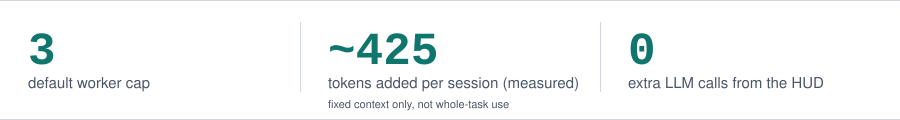
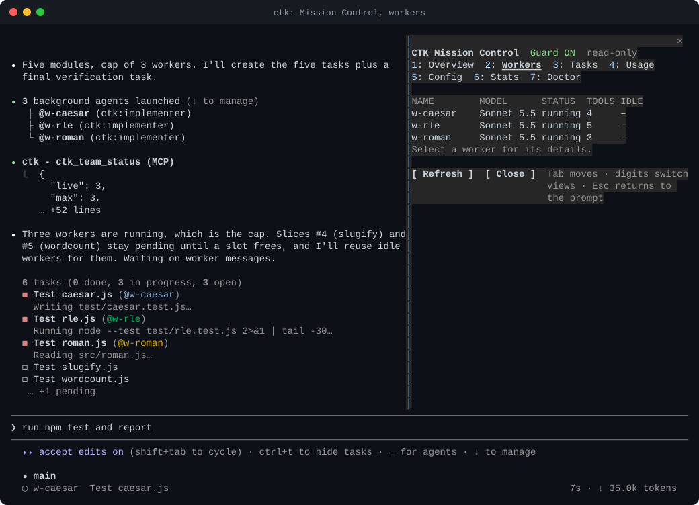
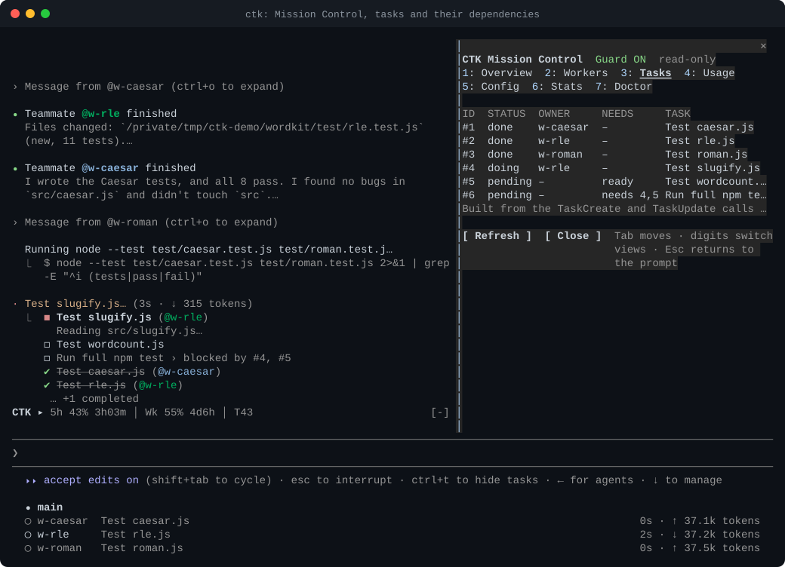

<p align="center">
  <picture>
    <source media="(prefers-color-scheme: dark)" srcset="docs/assets/logo-dark.svg">
    
  </picture>
</p>

<p align="center"><b>Hard worker limits, live team visibility, and portable configuration for Claude Code.</b></p>

<p align="center">
  <a href="https://github.com/tc3oliver/claude-team-kit/actions/workflows/ci.yml"></a>
  <a href="LICENSE"></a>
</p>

<p align="center">
  <picture>
    <source media="(prefers-color-scheme: dark)" srcset="docs/assets/stats-dark.svg">
    
  </picture>
</p>

Claude Team Kit (CTK) is a Claude Code plugin for the built-in Agent Teams. It caps how many teammates run at once, puts each role on a suitable model, and shows the team in one line above your prompt, which you can click to open a read-only dashboard. The lead and the teammates stay Claude Code's own: CTK does not add a second orchestrator.

<p align="center">
  
</p>

<p align="center"><sub>One live session, installed through the Plugin Manager, 79 s played back in 45 s. The request is a plain sentence, not a slash command; the lead loaded the team skill itself, created six tasks and started three workers (the cap). A real mouse click on <code>CTK ▸</code> opens Mission Control: guard, workers with their models and tool calls, tasks with <code>needs 4,5</code> on the final run, usage. This is one run on a small fixture; another run may behave differently. Notes, including the band's few-second gap and the seven earlier takes: <a href="docs/DEMO.md#run-e-asked-in-plain-words-then-the-band-is-clicked-open">docs/DEMO.md</a> (also as <a href="docs/assets/mission-control-e.gif">GIF</a> and <a href="docs/assets/mission-control-e.mp4">MP4</a>).</sub></p>

## Install

In Claude Code:

```
/plugin marketplace add tc3oliver/claude-team-kit
/plugin install ctk@ctk-kit
```

Then `/reload-plugins` (or restart). Needs Claude Code 2.1.287 or newer for the cap and the team line. Claude Code may print `8 userConfig options not yet set`: that is harmless, every option has a default.

**One setting a plugin cannot make for you.** Agent Teams are experimental and off by default. Add this to `~/.claude/settings.json` and restart:

```json
{ "env": { "CLAUDE_CODE_EXPERIMENTAL_AGENT_TEAMS": "1" } }
```

Not sure? Run `/ctk-doctor`. It changes nothing and prints the exact fix for anything missing. On Claude 5.x models, also add `"CLAUDE_CODE_ENABLE_TODO_TOOLS": "1"` to the same `env` if you want the shared task list shown in the demo; without it the lead coordinates by messages. Details: [Installation](docs/INSTALLATION.md#one-time-setup-agent-teams).

## How CTK works

**From one prompt to a coordinated team.**

<p align="center">
  
</p>

<p align="center"><sub><b>An illustration, not a recording</b>: the scenario and the timings are invented. The real session is the recording at the top. Also as <a href="docs/assets/how-it-works.mp4">MP4</a> and a <a href="docs/assets/how-it-works-poster.png">poster image</a>.</sub></p>

- **Plan.** The lead cuts the goal into vertical slices, each one working and checkable on its own, with the dependencies that really exist. *Skill-guided; Claude Code keeps the shared task list when the task tools are on.*
- **Coordinate.** Blocked tasks cannot be claimed and the skill starts the ready ones; while the mod is active, teammate spawns are capped at three by default. The next ready task goes to an idle teammate with a short handoff: task ID, spec path, file scope, verification command (the skill also names a base commit). *Claude Code holds the dependencies, the CTK mod caps teammate spawns, the lead chooses the handoffs.*
- **Execute.** Native teammates work in parallel; a ready task beyond the cap waits for a slot. CTK does not queue or schedule it: the lead keeps it pending and offers it again when a slot frees.
- **Verify.** Done means verified: the lead runs the check and reads the result before closing the last task. *Skill-guided; no code enforces it, and a passing check is not a guarantee.*

**Native Agent Teams. Structured Execution. Controlled Parallelism.** The first is Claude Code, the second is what CTK's skills ask the model to do, the third is the only gate CTK enforces in code, and only on teammate spawns. Step by step, with what was and was not seen live: [How CTK works](docs/WORKFLOW.md).

## Your first team

Ask in words, or use the command; both reach the same skill:

```
Use a team to implement this feature and review the result.
/ctk:team <goal>
```

The demo asked for this on the small fixture in [`scripts/demo/fixture`](scripts/demo/fixture/README.md) (five text modules, no tests):

```
Use a team to add one node:test file per module in src/, named test/<module>.test.js, one worker per module. Then run npm test and report the results.
```

Whether a sentence loads the team skill is Claude's decision: CTK adds no intent classifier and rewrites no prompt. The skill's description asks for it when you want a team, several agents or parallel work, and a plain "fix this bug" is meant to stay a plain request, but neither is guaranteed ([how it was checked](docs/NATURAL-LANGUAGE.md)). `/ctk:team` always loads it. The skill tells the lead to check that teams are on and read the cap, split the goal into independently verifiable tasks, start workers up to the cap, and run the verify commands itself before reporting; the cap is enforced by CTK's mod, the rest is guidance the lead follows. `/ctk-stats` shows what the session counted.

## Mission Control

The `CTK ▸` line above the prompt is a button: click it, or run `/ctk-mission`, to open a read-only dashboard beside the transcript. Nothing in it spawns, stops or changes anything.

<p align="center">
  
  
</p>

<p align="center"><sub>Stills from the recording above: workers with their model and tool calls, and the task list with its dependencies. The pane is about 50 cells wide next to a 120-column terminal, so the tables switch to a compact form.</sub></p>

- **Views:** Overview (guard, workers, tasks, team time, usage), Workers (select one for its agent id, model, status, current task, tool calls, last activity), Tasks (select one for owner, ready or blocked, what it needs and what it blocks), Usage, Config, Stats, Doctor. Digits `1` to `7` switch views; `Esc` returns to the prompt.
- **Only what was observed.** Figures come from Claude Code's own events and API; anything CTK could not observe reads `unavailable`, never a made-up zero.
- **Changing a setting from plain words.** "Set the worker cap to 2" makes the model propose the change; it applies only when you press Confirm in the pane. The model cannot write `settings.json` or skip the confirmation ([notes](docs/MISSION-CONTROL.md)).

## Why Claude Team Kit?

- **A hard worker limit.** Claude Code's docs say there is "no hard limit on the number of teammates". CTK enforces one on teammates: default 3, settable from 1 to 12. A teammate spawn above it is refused with `TEAM_CAPACITY_REACHED` and its task stays pending; if CTK cannot count the team, it refuses rather than guesses. Ordinary subagents are not counted.
- **Live team visibility.** One line above the prompt: model, 5-hour and weekly usage with reset countdowns, tool calls, agents against the cap, tasks, context and cost, fitted to your terminal (full, abbreviated or essentials only; whole figures are dropped, never cut in half). It reads only what Claude Code hands it: no network calls, no credential reads, no model calls.
- **Models by role.** Explorers on Haiku, implementers and reviewers on Sonnet, the high-risk reviewer on Opus, unless a spawn names a model.
- **Four skills, small footprint.** `/ctk:team`, `/ctk:review` (scaled to risk), `/ctk:debug` and `ctk` (status, settings, profile sync in plain words). The plugin adds about 425 tokens to a session, measured with a real call; a skill's body loads only when it is used (`/ctk:team` about 850 by Claude Code's estimate).
- **Honest numbers.** `/ctk-stats` labels each figure as counted by CTK or measured by Claude Code. Claude Code does not report per-worker cost, so CTK shows none.

<p align="center">
  
</p>

<p align="center"><sub>The HUD at five terminal widths, copied from live captures (Claude Code 2.1.295; usage figures are the maintainer's account at that moment). Wide terminals get full wording, narrower ones abbreviations, and the narrowest only the three figures that matter most. Details: <a href="docs/ARCHITECTURE.md#layout">layout</a>.</sub></p>

## Hard limit and team line

<p align="center">
  
  
</p>

<p align="center"><sub><b>Left (the earlier Run D recording):</b> at the cap, the lead keeps tasks #4 and #5 pending instead of spawning; the final run is <code>blocked by #4, #5</code>; the team line reads <code>team 3 busy · … / cap 3 · tasks 3/6</code>. No spawn was refused in this run. <b>Right (an earlier attempt, not the published demo, stopped for an unrelated <code>PATH</code> problem):</b> the only recorded live refusal. Claude Code's own agent list showed the refused spawns as "Done"; the lead read the refusal and reused idle workers through <code>SendMessage</code> (<a href="docs/DEMO.md#attempt-1-the-cap-refusing-live-not-the-published-run">notes</a>).</sub></p>

## Model routing and portable configuration

Change the cap, the model per role, the team line and stats recording with `/plugin configure ctk@ctk-kit` ([options](docs/INSTALLATION.md#options)). An explicit model in a spawn is never overridden.

**Advanced: the optional `ctk` CLI.** For a status line, profiles synced between machines through a git repository you own (whitelisted keys, a secrets scan before every publish, three-way merge), and an install ledger with `ctk rollback` and `ctk uninstall`. It is built from a checkout (`git clone`, `npm ci`, `npm run build`, then `npm run ctk -- install`): see [the optional CLI](docs/INSTALLATION.md#the-optional-ctk-cli) and [Configuration](docs/CONFIGURATION.md).

## Status

Public preview (v0.1.0): not on npm or in an official plugin directory. Agent Teams are experimental and Mods, which carry the cap and the team line, are early access; where Mods are missing (older builds, reportedly WSL) `/ctk:team` says the cap and team line are off, and `/ctk-doctor` is not available. Used interactively on macOS; Windows and Linux are covered by [CI](https://github.com/tc3oliver/claude-team-kit/actions/workflows/ci.yml) only.

## Learn more

[Installation](docs/INSTALLATION.md) · [Limitations](docs/LIMITATIONS.md) · [Demo notes](docs/DEMO.md) · [Configuration](docs/CONFIGURATION.md) · [Architecture](docs/ARCHITECTURE.md) · [How CTK works](docs/WORKFLOW.md) · [Mission Control](docs/MISSION-CONTROL.md) · [Natural language](docs/NATURAL-LANGUAGE.md) · [Comparison with OMC, superpowers and claude-hud](docs/COMPARISON.md) · [Coming from OMC](docs/MIGRATION-FROM-OMC.md) · [Threat model](docs/THREAT-MODEL.md) · [Verification record](docs/REVIEW.md) · [Rollback](docs/ROLLBACK.md)

---

[Contributing](CONTRIBUTING.md) · [Code of Conduct](CODE_OF_CONDUCT.md) · [Security](SECURITY.md) · [Changelog](CHANGELOG.md) · MIT [License](LICENSE) · [Third-party notices](THIRD_PARTY_NOTICES.md)
