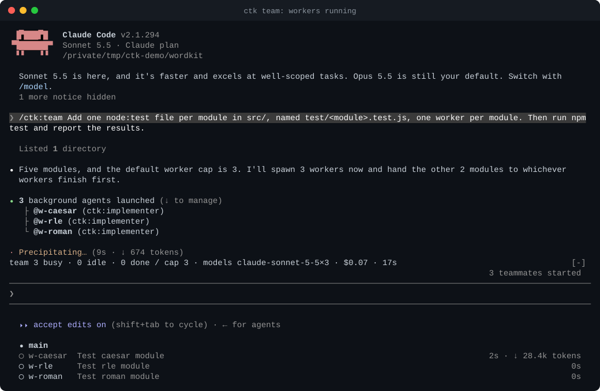
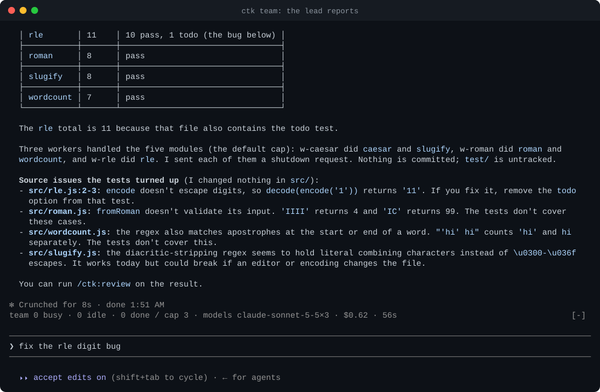

<p align="center">
  <picture>
    <source media="(prefers-color-scheme: dark)" srcset="docs/assets/logo-dark.svg">
    
  </picture>
</p>

<p align="center"><b>A worker cap, role-based models and a one-line team HUD for Claude Code's native Agent Teams.</b></p>

<p align="center">
  <a href="https://github.com/tc3oliver/claude-team-kit/actions/workflows/ci.yml"></a>
  <a href="LICENSE"></a>
  
</p>

**Agent Teams have "no hard limit on the number of teammates", and they "use significantly more tokens than a single session"** ([Claude Code docs](https://code.claude.com/docs/en/agent-teams)).
**CTK caps live teammates, puts each role on the right model and shows the team above your prompt.** It is a ~187-token plugin on top of the native teams, not a second orchestrator.

<p align="center">
  
</p>

<p align="center"><sub>One live <code>/ctk:team</code> session, played at about 1.8× with idle gaps shortened and account details masked. Sonnet lead, five modules, default cap of 3: the lead planned three workers, gave the last two modules to whoever finished first, ended with 44 tests (43 pass, 1 todo), and a worker found a real bug in the fixture. Whole session: $0.64. How it was recorded: <a href="docs/DEMO.md">docs/DEMO.md</a> (also as <a href="docs/assets/team-demo.gif">GIF</a> and <a href="docs/assets/team-demo.mp4">MP4</a>).</sub></p>

<p align="center">
  
  
</p>

<p align="center"><sub><b>Left:</b> "Five modules, and the default worker cap is 3": the lead plans around the cap, and the band above the prompt reads <code>team 3 busy · 0 idle · 0 done / cap 3</code>. <b>Right:</b> the lead's report: who did which module, and four source issues the tests turned up, left for you to decide.</sub></p>

<p align="center">
  
</p>

<p align="center"><sub>The cap refusing live, from <b>attempt 1</b> (stopped for an unrelated <code>PATH</code> problem, so not the published run; <a href="docs/DEMO.md#attempt-1-the-cap-refusing-live-not-the-published-run">its notes</a>). Note the red <code>TEAM_CAPACITY_REACHED</code> and <code>rejected 1</code> in the band. Claude Code's own agent list drew the refused spawns as "finished … Done"; the lead still read them as refused and reused idle workers through <code>SendMessage</code>.</sub></p>

<!-- RUN-B-SLOT -->

## Quick start

Needs Node 22+, git, and Claude Code 2.1.287+ for the cap and band.

```bash
git clone https://github.com/tc3oliver/claude-team-kit && cd claude-team-kit
npm ci && npm run build
npm run ctk -- install          # run with --dry-run first to see the plan; nothing is written
```

Restart Claude Code (or `/reload-plugins`), then `/ctk:team <goal>`. **Undo any time:** `npm run ctk -- uninstall` (backups are kept). `npm run ctk -- doctor` checks the install, and `/ctk-stats` shows what the team did. Keep the checkout where it is: the plugin marketplace points at it. To replay the demo, use the fixture in [`scripts/demo/fixture`](scripts/demo/fixture/README.md). More: [Installation](docs/INSTALLATION.md).

> **Status: public preview, v0.1.0 not yet released.** No npm package or marketplace listing yet. Agent Teams are experimental in Claude Code and mods, which carry the cap and band, are early access. On Claude 5.x models Claude Code leaves out the Task tools, so the lead coordinates by messages; the shared task list is opt-in with `ctk config set claude.enableTaskTools true`. Used interactively on macOS; Windows and Linux are covered by [CI](https://github.com/tc3oliver/claude-team-kit/actions/workflows/ci.yml) only. Read [Limitations](docs/LIMITATIONS.md) before you rely on it.

## Why Claude Team Kit?

- **A hard cap.** Default 3 live teammates (1 to 12). A spawn above it is refused with `TEAM_CAPACITY_REACHED` and its task stays pending; if CTK cannot count the team it refuses with `TEAM_GUARD_FAILED` instead of guessing.
- **Models by role.** `ctk:explorer` on Haiku, `ctk:implementer` and `ctk:reviewer` on Sonnet, `ctk:high-risk-reviewer` on Opus. Configurable; an explicit model is never overridden.
- **Small fixed context.** About 187 tokens always loaded (`claude plugin details`). The bodies of the three skills (`/ctk:team`, `/ctk:review`, `/ctk:debug`) load only when used.
- **A HUD that only reads what Claude Code hands it.** One dim band above the prompt, plus a status line fallback. No network calls, no credential reads. `/ctk-stats` labels figures as counted or measured and never estimates per-worker cost, which Claude Code does not report.
- **Settings that follow you.** `ctk sync` keeps a profile in any git repository you own: whitelisted keys, a secrets scan before every publish, three-way merge on pull.
- **Reversible.** A ledger and backups behind `ctk rollback` and `ctk uninstall`; CTK writes only keys it owns and never replaces a setting of yours.

## How it compares

Neutral facts with sources, and when to pick something else: [docs/COMPARISON.md](docs/COMPARISON.md).

- **Native Agent Teams.** CTK runs on them and replaces nothing. If you want no cap, routing or band, the experimental flag alone is enough.
- **oh-my-claudecode (OMC).** Choose it for ready-made workflows (autopilot, ralph, a staged team pipeline), MCP-backed memory and Codex, Gemini or Cursor workers in tmux; CTK has none of these. Measured the same way by CTK's maintainers (not independently reproduced), OMC 5.3.0 loads 3,174 and 2,093 tokens of always-on plugin context (main install, fresh config): CTK carries about 94% and 91% less, **fixed context only**, not whole-task tokens. Coming from OMC: [migration notes](docs/MIGRATION-FROM-OMC.md).
- **superpowers, mattpocock/skills.** Development-method skill libraries. They do a different job and can sit next to CTK (that combination is untested).
- **claude-hud.** A stand-alone status line with many display options. CTK's status line is only a fallback; how each HUD gets its data is in the [comparison](docs/COMPARISON.md#hud-and-status-data-sources).

## Docs

[Installation](docs/INSTALLATION.md) · [Configuration and sync](docs/CONFIGURATION.md) · [Architecture](docs/ARCHITECTURE.md) · [Demo notes](docs/DEMO.md) · [Limitations](docs/LIMITATIONS.md) · [Threat model](docs/THREAT-MODEL.md) · [Verification record](docs/REVIEW.md) · [Rollback](docs/ROLLBACK.md)

---

[Contributing](CONTRIBUTING.md) (`npm run check` is the gate) · [Code of Conduct](CODE_OF_CONDUCT.md) · [Security](SECURITY.md) · [Changelog](CHANGELOG.md) · MIT [License](LICENSE) · [Third-party notices](THIRD_PARTY_NOTICES.md)
