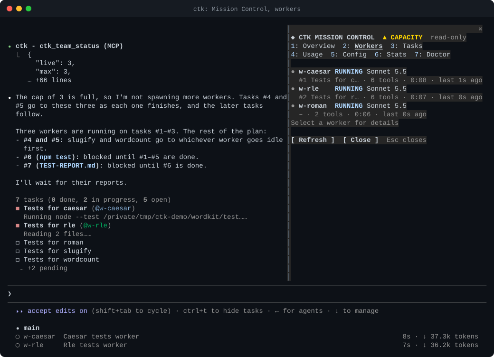
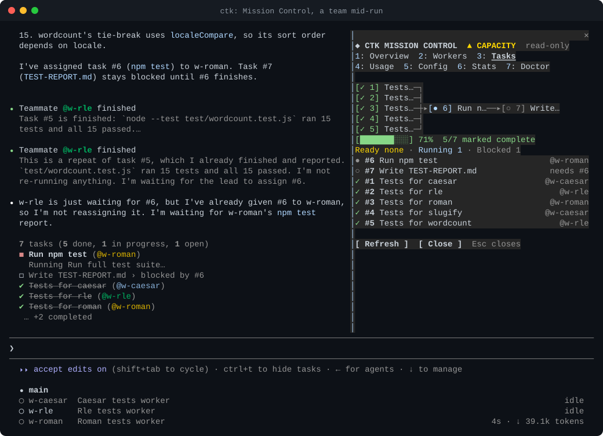
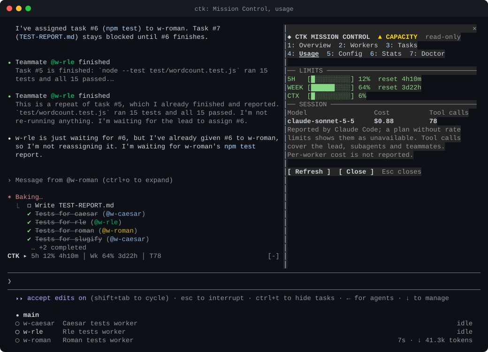

<p align="center">
  <picture>
    <source media="(prefers-color-scheme: dark)" srcset="docs/assets/logo-dark.svg">
    
  </picture>
</p>

<h2 align="center">Build with a team. Stay in control.</h2>

<p align="center">
  Turn complex tasks into coordinated Claude Code agent teams.<br>
  Set hard limits, watch teammates work, and follow task dependencies live.
</p>

<p align="center"><b>Native teams. Real visibility. Your rules.</b></p>

<p align="center">
  <a href="#install"><b>Install CTK</b></a>
  &nbsp;·&nbsp; <a href="#mission-control"><b>Watch Mission Control</b></a>
  &nbsp;·&nbsp; <a href="#how-ctk-works"><b>How it works</b></a>
</p>

<p align="center">
  <a href="https://github.com/tc3oliver/claude-team-kit/actions/workflows/ci.yml"></a>
  <a href="LICENSE"></a>
</p>

<p align="center">
  
</p>

<p align="center"><sub><b>A real Claude Code session, not a mockup.</b> One sentence starts the team; one click opens Mission Control. Account details are masked, and results vary from run to run. <a href="docs/DEMO.md#run-f-the-redesigned-mission-control-docked-beside-a-live-team">Recording notes</a> · <a href="docs/assets/mission-control-f.mp4">MP4</a> · <a href="docs/assets/mission-control-f.gif">GIF</a></sub></p>

## Three reasons to use CTK

### Coordinated native teams
One goal, several teammates, clear tasks and dependencies. Claude Code's own Agent Teams do the work; CTK's skill guides the lead to split the goal into verifiable tasks and to check the result before calling it done.

### Hard worker limits
Choose how many native teammates may be live at once (default 5, from 1 to 12). A spawn above the limit is refused and its task stays pending. Claude Code itself documents no such limit.

### Mission Control
See workers, tasks, dependencies and usage without leaving Claude Code. It is read-only: it never starts, stops or changes anything.

## Install

Two ways, both through Claude Code's own Plugin Manager.

### Install with your AI Agent

Paste this into Claude Code (or another coding agent that can run shell commands):

```text
Install Claude Team Kit (CTK), a Claude Code plugin, by following the checklist at
https://raw.githubusercontent.com/tc3oliver/claude-team-kit/main/INSTALL.md

Rules: use only Claude Code's native Plugin Manager (`claude plugin ...`); no other installer, no `curl | bash`,
no `npm install`. Check `claude --version` and any existing CTK install first. Show me the exact change to
settings.json and wait for my yes before editing it; merge only, and keep my other plugins, MCP servers, hooks and
settings. Do not uninstall or disable anything else, including OMC. Tell me which steps only I can run
(`/reload-plugins` or a restart, then `/ctk-doctor`) and what the result should look like.
```

The agent follows [INSTALL.md](INSTALL.md): it installs with the two commands below, adds the Agent Teams setting only after you agree, and asks you to reload and run `/ctk-doctor`.

### Manual install

In Claude Code:

```
/plugin marketplace add tc3oliver/claude-team-kit
/plugin install ctk@ctk-kit
```

Then run `/reload-plugins` (or restart). CTK needs Claude Code 2.1.287 or newer.

**Turn on Agent Teams.** They are experimental and off by default, and a plugin cannot switch them on. Add this to the `env` object in `~/.claude/settings.json` (keep your other settings), then restart:

```json
"env": { "CLAUDE_CODE_EXPERIMENTAL_AGENT_TEAMS": "1" }
```

Run `/ctk-doctor` to check the setup: it changes nothing and prints the exact fix for anything missing. Details, Claude 5.x notes and options: [Installation](docs/INSTALLATION.md).

## Your first team

Ask in plain words:

```
Use a team to implement this feature, write tests, and review the result.
```

Or be explicit with `/ctk:team <goal>`. The explicit command always loads the team skill. A plain sentence usually does too, but the model decides, so use the command when you want to be sure ([how it works](docs/NATURAL-LANGUAGE.md)). Then click `CTK ▸` above the prompt to open Mission Control.

## How CTK works

<p align="center">
  
</p>

<p align="center"><sub><b>Conceptual illustration.</b> The scenario and timings are invented; the recording at the top is the real session. <a href="docs/assets/how-it-works.mp4">MP4</a></sub></p>

**Plan** → **Coordinate** → **Execute** → **Verify**

Claude Code provides the agent team and its shared task list. CTK's skill guides the lead through the four steps, and CTK's mod enforces the limit on native teammates. CTK has no scheduler of its own. Full division of work: [How CTK works](docs/WORKFLOW.md).

## Mission Control

Click the `CTK ▸` line above the prompt, or run `/ctk-mission`. Seven views: Overview, Workers, Tasks, Usage, Config, Stats and Doctor; keys `1` to `7` switch, `Esc` closes. Figures come from Claude Code's own events and API, and anything CTK could not observe reads `unavailable`, never a made-up zero.

<p align="center">
  <a href="docs/assets/mission-control-f-workers.svg"></a><br>
  <b>Live workers</b><br>
  <sub>Who is running what, on which model, and how recently it did something.</sub>
</p>

<p align="center">
  <a href="docs/assets/mission-control-f-poster.svg"></a><br>
  <b>Task dependency graph</b><br>
  <sub>Drawn only from the dependencies the lead declared; waiting, ready, running and done are distinct.</sub>
</p>

<p align="center">
  <a href="docs/assets/mission-control-f-usage.svg"></a><br>
  <b>Usage</b><br>
  <sub>5-hour and weekly limits, context and session cost, as Claude Code reports them.</sub>
</p>

<p align="center"><sub>Stills from the recording above; tap one for full size. More layouts, at other widths, are in the <a href="docs/DEMO.md#mission-control-screenshots-synthetic-data">synthetic-data screenshots</a>, which are labelled as such.</sub></p>

## Everything else

- **Models by role.** Explorers on Haiku, implementers and reviewers on Sonnet, the high-risk reviewer on Opus, unless a spawn names a model. An optional read-only `designer` on Opus writes UI/UX briefs; it is new on main and has not yet been part of a recorded run.
- **Risk-based review.** `/ctk:review` scales reviewer depth to the risk of the change.
- **Debugging workflow.** `/ctk:debug` asks for a failing reproduction before a fix; when a standalone debugging skill is installed, generic debugging should use one diagnosis protocol, not two.
- **Optional Backlog / BetFirst composition.** CTK runs independently; when explicitly combining tools, the team lead alone owns durable task updates. [Workflow contract](docs/WORKFLOW.md#optional-external-backlog-tasks-skill-guided-not-a-dependency).
- **Natural-language control.** Ask in words for a team or for a setting change, such as "set the worker cap to 2"; the change applies only after you press Confirm in Mission Control ([details](docs/NATURAL-LANGUAGE.md)).
- **Usage HUD.** A team line above the prompt with the model, 5-hour and weekly usage, agents against the limit, tasks and cost, fitted to your terminal width. It reads only what Claude Code hands it: no network calls, no model calls.
- **Portable configuration.** Change options with `/plugin configure ctk@ctk-kit`. The optional `ctk` CLI syncs a profile between machines through a git repository you own, with a secrets scan before every publish ([Configuration](docs/CONFIGURATION.md)).
- **Small footprint.** The plugin adds about 480 tokens to a session (measured with a real call). No speed, cost or token-saving claim is made.

## Limitations

- Agent Teams are experimental, and Mods, which carry the limit and the team line, are early access. Where Mods are missing, `/ctk:team` says the limit and the team line are off.
- The hard limit counts native teammates only. Ordinary subagents are not counted or limited.
- The team workflow is guided by a skill that the model may follow imperfectly. CTK is not another scheduler.
- Used interactively on macOS. Linux and Windows are covered by CI only, and the agent install prompt has not been run end to end.
- Status: public preview, released as the GitHub pre-release [`v0.1.3`](https://github.com/tc3oliver/claude-team-kit/releases/tag/v0.1.3), a follow-up hardening of `v0.1.2`: `sync init` now migrates a stored credential remote in place instead of dead-ending, backup restores are integrity-checked before the write, and `--json` is honoured on every error path. The install commands above follow `main`.

More: [Limitations](docs/LIMITATIONS.md) · [Architecture](docs/ARCHITECTURE.md) · [Threat model](docs/THREAT-MODEL.md)

## Documentation

[Installation](docs/INSTALLATION.md) · [How CTK works](docs/WORKFLOW.md) · [Mission Control](docs/MISSION-CONTROL.md) · [Natural language](docs/NATURAL-LANGUAGE.md) · [Configuration](docs/CONFIGURATION.md) · [Architecture](docs/ARCHITECTURE.md) · [Limitations](docs/LIMITATIONS.md) · [Recordings](docs/DEMO.md) · [Verification record](docs/REVIEW.md) · [Comparison with OMC, superpowers and claude-hud](docs/COMPARISON.md) · [Coming from OMC](docs/MIGRATION-FROM-OMC.md) · [Rollback](docs/ROLLBACK.md)

---

[Contributing](CONTRIBUTING.md) · [Code of Conduct](CODE_OF_CONDUCT.md) · [Security](SECURITY.md) · [Changelog](CHANGELOG.md) · MIT [License](LICENSE) · [Third-party notices](THIRD_PARTY_NOTICES.md)
