<p align="center">
  <picture>
    <source media="(prefers-color-scheme: dark)" srcset="docs/assets/logo-dark.svg">
    
  </picture>
</p>

<p align="center"><b>A lightweight, token-aware, portable team companion for Claude Code.</b></p>

<p align="center">
  <a href="https://github.com/tc3oliver/claude-team-kit/actions/workflows/ci.yml"></a>
  <a href="LICENSE"></a>
  
</p>

**Claude Code's Agent Teams are powerful, and they ship with no worker limit.** CTK keeps them native and adds what a daily driver needs: a hard cap on live teammates, role-based model routing, a one-line team HUD, and settings that follow you between machines. It adds about 187 tokens of fixed context and no second orchestrator.

- **Runaway spawns.** The official docs say "there's no hard limit on the number of teammates". CTK refuses the spawn above your cap (default 3) with an explicit `TEAM_CAPACITY_REACHED`, and the lead keeps the task pending instead of pretending it started.
- **Heavy always-on context.** An orchestration plugin you do not invoke still loads on every turn. CTK's is ~187 tokens, measured with `claude plugin details`; the [comparison](docs/COMPARISON.md) has the numbers and how to reproduce them.
- **Setup that stays on one laptop.** Team policy, model routing and HUD settings live in a git-synced profile with a secrets scan, instead of being copied by hand.

<p align="center">
  
</p>

<p align="center"><sub>Recording of <code>ctk install --dry-run</code>, <code>ctk install</code>, <code>ctk doctor</code> and <code>claude -p "/ctk-stats"</code> in a scratch config directory (Claude Code 2.1.294, no model call). Raw source: <a href="docs/assets/install.frames.jsonl">install.frames.jsonl</a>; its first line records date, versions and commit.</sub></p>

> **Status: public preview, release candidate for v0.1.0.** Not released: there is no npm package, no marketplace listing, no GitHub release and no tag. Install from a checkout (below). See [Limitations](#limitations) and [Status of evidence](#status-of-evidence) first.

## Why Claude Team Kit?

| Pillar | What it means here | Where to check it |
|---|---|---|
| **Native Agent Teams** | CTK is a plugin, a cap and three skills on top of Claude Code's own teams. There is no second orchestrator, phase state machine or scheduler. | [Architecture](docs/ARCHITECTURE.md) |
| **Minimal context overhead** | Always-on plugin context is about 187 tokens (`claude plugin details ctk@ctk-kit`). The maintainers measured OMC 5.3.0 the same way at 3,174 tokens (main install) and 2,093 (fresh scratch config), not independently reproduced: about 94% and 91% less **fixed plugin context**. That is fixed context only, not whole-task tokens, which depend on the work, the models and the team size. | [Comparison](docs/COMPARISON.md) |
| **Team HUD and hard worker limit** | Default cap of 3 live teammates (1 to 12). A spawn above it is refused with `TEAM_CAPACITY_REACHED`. A one-line band above the prompt shows the team. The cap was observed live in the project's proof of concept (6 concurrent spawns: 3 started, 3 refused); in this repository it is covered by simulated-host tests with mutation checks. A live re-run is part of the pending recording. | [Limitations](docs/LIMITATIONS.md#the-hard-cap) |
| **Portable config** | A profile (defaults, user layer, per-device overrides) synced through a plain git repository: whitelisted settings only, secrets scan before publish, three-way merge. | [Configuration](docs/CONFIGURATION.md) |

## Quick start

Prerequisites: Node 22 or newer (CI runs 22 and 24), Claude Code 2.1.287 or newer for the mod (cap and band), git. No login and no network are needed to install; a team needs a logged-in Claude Code.

```bash
git clone https://github.com/tc3oliver/claude-team-kit && cd claude-team-kit
npm ci && npm run build
npm run ctk -- install --dry-run     # prints the plan; CTK writes nothing
npm run ctk -- install
```

Restart Claude Code (or run `/reload-plugins`), then `/ctk:team <goal>`. Examples below write `ctk` for `npm run ctk --` (or run `npm link` once to get a real `ctk` command). To undo: `npm run ctk -- uninstall` (backups are kept). Keep the checkout where it is: the plugin marketplace points at it ([moving it](docs/INSTALLATION.md#moving-or-deleting-the-install-directory)). With `--dry-run` CTK writes nothing; Claude Code itself may still create `.claude.json` or normalise `settings.json` when CTK runs its `claude` commands. More: [Installation](docs/INSTALLATION.md).

**A first team.** The repository ships a small fixture, `scripts/demo/fixture`: five independent text utilities (`caesar`, `rle`, `roman`, `slugify`, `wordcount`) with no tests. Copy it out and start Claude Code there:

```bash
cp -R scripts/demo/fixture /tmp/wordkit && cd /tmp/wordkit && git init -q && claude
```

```
/ctk:team Add one node:test file per module in src/, named test/<module>.test.js, one worker per module. Then run npm test and report the results.
```

What to look for: the lead should create five tasks and spawn teammates as `ctk:implementer`; with the default cap of 3, a fourth spawn while three are alive should be refused with `TEAM_CAPACITY_REACHED` and its task should stay `pending` until a slot frees. This describes what the skill and the mod are built to do, not a recorded output. `/ctk-stats` shows the counts afterwards.

### Team session recording

A recorded live team session is not yet included; [scripts/demo/README.md](scripts/demo/README.md) describes how the recordings in `docs/assets` are made.

## Features

- **Teammate cap** enforced in a Claude Code mod; refuses at capacity and fails closed when it cannot count.
- **Model routing by role**: `ctk:explorer` (haiku), `ctk:implementer` (sonnet), `ctk:reviewer` (sonnet), `ctk:high-risk-reviewer` (opus). Models are configurable; an explicit model is never overridden.
- **Three skills**: `/ctk:team`, `/ctk:review` (risk-based), `/ctk:debug`. Their bodies load only when invoked.
- **Team band** above the prompt, plus a status line fallback for builds without mods.
- **Honest stats**: `ctk stats` and `/ctk-stats` label figures as counted or measured. Claude Code reports no per-worker cost, so CTK shows none and estimates none.
- **Reversible installer**: ledger, backups, `ctk rollback`, `ctk uninstall`. It writes only keys it owns and never replaces a setting you set.
- **`ctk doctor`** checks Node, Claude Code, plugin, settings, ledger and backups.
- **Git profile sync** with a secrets scan, a whitelist and conflict reporting.
- Coming from Oh My Claude Code? [Migration notes](docs/MIGRATION-FROM-OMC.md).

## CTK vs OMC vs native Claude Code

Facts and sources are in [docs/COMPARISON.md](docs/COMPARISON.md), which also covers superpowers, mattpocock/skills and claude-hud. OMC statements describe the 5.3.0 plugin cache; upstream is newer (5.6.2) and was not examined.

| | CTK 0.1.0 | OMC 5.3.0 | Native Agent Teams |
|---|---|---|---|
| What it adds | Cap, role routing, 3 skills, 4 agents, band, install/sync CLI | Staged team pipeline, autopilot/ralph/ralplan workflows, 37 skills, 19 agents, MCP server, HUD, notifications | Lead, teammates, shared task list, mailboxes |
| Own orchestrator | No | Yes | Is the native orchestrator |
| Hooks / MCP | `Hooks (0)`; one in-process mod; no MCP | 25 hook commands over 11 events; 1 MCP server | Hook events `TeammateIdle`, `TaskCreated`, `TaskCompleted` |
| Worker limit | `maxWorkers`, default 3, enforced by refusing spawns | `omc team`: 20; cap on native team spawns not stated | "No hard limit"; suggests 3-5 |
| Non-Claude workers | No | Codex, Gemini, Cursor and others as tmux workers | No |
| HUD data source | Claude Code's `statusLine` stdin JSON and the public Mods API only; no network, no credential reads | Reads Claude Code's stored OAuth credential, calls the usage endpoint, refreshes and writes tokens back (`dist/hud/usage-api.js`); not mentioned in its README | Agent panel; no status line described |
| Cross-device config sync | `ctk sync` (git) | Not stated | None |
| Reversible installer | Ledger, backups, rollback | Not stated | n/a |
| Needs | Claude Code >= 2.1.287, experimental teams flag | Plugin install and `/omc-setup`; tmux for multi-vendor workers | Experimental flag |

Choose another project when it fits better: native teams alone if no cap or routing is wanted; OMC for ready-made workflows and multi-vendor workers; superpowers or mattpocock/skills for a development method (they are skills libraries and are not known to conflict with CTK, untested); claude-hud for a stand-alone status line.

## Team and HUD usage

| Command | Purpose |
|---|---|
| `/ctk:team <goal>` | Lead a capped team: one agent by default, independent slices only when worthwhile, every spawn confirmed. |
| `/ctk:review [spec]` | Self-checklist (low risk), `ctk:reviewer` (medium), `ctk:high-risk-reviewer` (high). |
| `/ctk:debug <symptom>` | Reproduce, minimise, hypothesise, fix, regression test; asks after three refuted hypotheses. |
| `/ctk-stats` | This session's counted and measured figures. |
| `ctk stats` | The same, per session and in total, from `<config>/ctk/stats`. |

The band is one dim line above the prompt. Format example (not a screenshot):

```
team 1 busy · 2 idle · 1 done / cap 3 · tasks 2/5 · rejected 1 · models haiku×1 sonnet×2 · $0.42 · 12m
```

`tasks` is completed/created and appears after the first task event; `rejected` appears when above zero; a figure Claude Code did not report is `–`; the line is cut to the terminal width and can be switched off with `hud.band`. The status line fallback prints one line in this shape (format example): `Opus high · ctx 42% · 5h 24% · 7d 61% · $1.23 · 12m · main*`. It reads only the JSON Claude Code passes it, `.git/HEAD` and one `git status`. A `statusLine` you already have is never replaced.

## Cross-device sync

```bash
git init --bare -b main ~/ctk-profiles.git        # any git remote works; a local bare repo is enough
ctk sync init --remote ~/ctk-profiles.git
ctk config set team.maxWorkers 4
ctk sync publish                                   # on the other machine: ctk sync init ..., then ctk sync pull
```

Pull is fast-forward only and merges three ways against the last synced snapshot; conflicts are written to a file and the command exits `2` until `ctk sync resolve <pointer> ours|theirs`. Publish scans every file and commit it would push for secret-like content and refuses without an override; the device layer is never published. A pulled profile is trusted input: use a repository only you can write to ([threat model](docs/THREAT-MODEL.md#a-pulled-profile-is-trusted-input)). Fields and layers: [Configuration](docs/CONFIGURATION.md).

## Architecture

```
ctk (CLI) ──edits by key──▶ settings.json ──▶ Claude Code
   │  ledger + backups                          │
   └─ claude plugin ... ──▶ plugin ctk@ctk-kit ─┤  skills: team review debug
                                                ├─ agents: explorer implementer reviewer high-risk-reviewer
                                                ├─ mod: cap · routing · band · stats ──▶ <config>/ctk/stats
                                                └─ status line fallback (short-lived node + git)
```

Details: [docs/ARCHITECTURE.md](docs/ARCHITECTURE.md).

## Security and privacy

CTK does not read credentials, conversation transcripts or the contents of `~/.claude.json` (`ctk doctor` checks only that the file exists). The mod and the status line make no network calls and use no OAuth or usage API; usage figures come from fields Claude Code passes them. The only network use is `git` during `ctk sync`, to the remote you chose. Files CTK creates are owner-only on POSIX (600/700). Report vulnerabilities as described in [SECURITY.md](SECURITY.md); what CTK reads and writes, and its known limits, are in [docs/THREAT-MODEL.md](docs/THREAT-MODEL.md).

## Limitations

| Area | State |
|---|---|
| Agent Teams | Experimental in Claude Code; needs `CLAUDE_CODE_EXPERIMENTAL_AGENT_TEAMS=1` (`ctk install` sets it when absent). |
| Mods | Early access, Claude Code >= 2.1.287. Without them the cap, routing, band and stats are inactive. |
| WSL | Mods reported unsupported there; not tested. |
| Windows, Linux | Automated tests and plugin checks pass in [CI](https://github.com/tc3oliver/claude-team-kit/actions/runs/37816500991) on GitHub-hosted runners; interactive use, Windows Terminal and VS Code UI not verified. |
| Cost | Per-worker cost is not available from Claude Code; CTK shows session figures only. |
| Effort | Per role, from the agent files; a profile cannot change it. |
| Live team | A full `/ctk:team` run is not yet recorded or verified end to end. |

Full list: [docs/LIMITATIONS.md](docs/LIMITATIONS.md).

### Status of evidence

| Level | What |
|---|---|
| Verified in CI | Typecheck, build, unit tests, `claude plugin validate --strict` and `claude plugin test` on Ubuntu, macOS and Windows, Node 22 and 24 ([run](https://github.com/tc3oliver/claude-team-kit/actions/runs/37816500991)); the badge shows the current state. |
| Verified locally | macOS, Claude Code 2.1.294, Node 24: install, doctor, rollback, uninstall, `/ctk-stats` in `claude -p`, the ~187-token figure. |
| Reported, not reproduced here | The cap with 6 live spawns (3 started, 3 refused); the OMC token figures. |
| Not verified | A live `/ctk:team` run; WSL; Windows Terminal and VS Code UI; Node 20 and older; interactive plugin approval prompts. |

## Contributing

Issues and pull requests are welcome; start with [CONTRIBUTING.md](CONTRIBUTING.md) (`npm run check` is the gate) and follow the [Code of Conduct](CODE_OF_CONDUCT.md). Release status is in [RELEASE_NOTES.md](RELEASE_NOTES.md) and [CHANGELOG.md](CHANGELOG.md).

## License

MIT. See [LICENSE](LICENSE). Third-party notices: [THIRD_PARTY_NOTICES.md](THIRD_PARTY_NOTICES.md).
