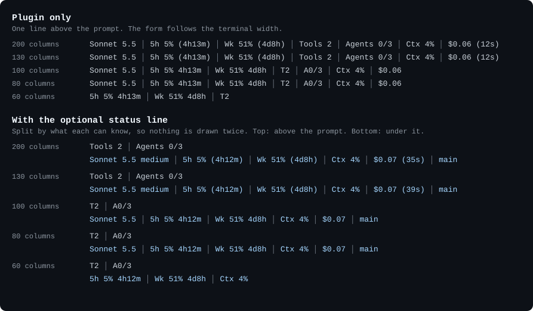
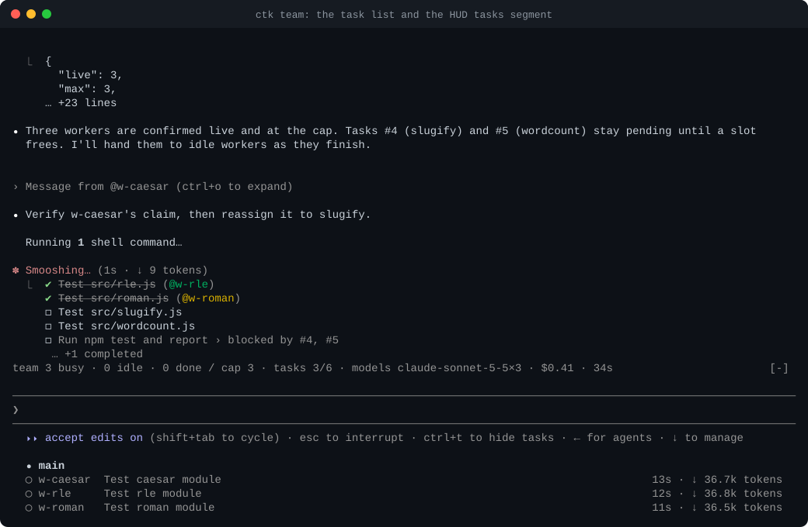
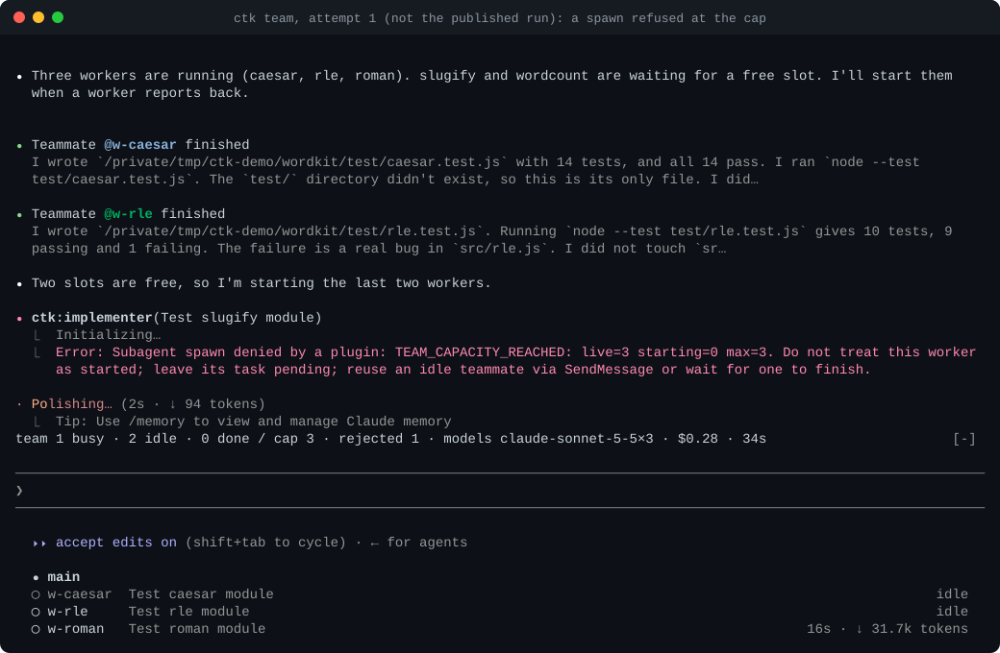

<p align="center">
  <picture>
    <source media="(prefers-color-scheme: dark)" srcset="docs/assets/logo-dark.svg">
    
  </picture>
</p>

<p align="center"><b>Control concurrency, see your team, and turn complex work into verifiable tasks.</b></p>

<p align="center">
  <a href="https://github.com/tc3oliver/claude-team-kit/actions/workflows/ci.yml"></a>
  <a href="LICENSE"></a>
  &nbsp;·&nbsp; <a href="#install"><b>Quick install ↓</b></a>
</p>

Claude Team Kit (CTK) is a lightweight companion plugin for Claude Code's native Agent Teams: a hard cap on how many teammates run at once, a clickable Mission Control for the team, and skills that guide the lead to split work into verifiable tasks. The lead and the teammates stay Claude Code's own; CTK is not a second orchestrator.

<p align="center">
  
</p>

<p align="center"><sub><b>Live Claude Code session.</b> One plain sentence starts the team; a real click on <code>CTK ▸</code> opens Mission Control beside the transcript. One run on a small fixture, played back at 185 s in 45 s; another run may behave differently. The account name, e-mail and organisation are masked. Recording notes: <a href="docs/DEMO.md#run-f-the-redesigned-mission-control-docked-beside-a-live-team">docs/DEMO.md</a> (also <a href="docs/assets/mission-control-f.gif">GIF</a>, <a href="docs/assets/mission-control-f.mp4">MP4</a>).</sub></p>

## From one prompt to a coordinated team

*Break down work. Run agents in parallel. Respect dependencies. Verify the result.*

<p align="center">
  
</p>

<p align="center"><sub><b>Conceptual workflow visualization.</b> The scenario and the timings are invented; the recording above is the real session. Also as <a href="docs/assets/how-it-works.mp4">MP4</a> and a <a href="docs/assets/how-it-works-poster.png">still image</a>.</sub></p>

**Plan** — Turn goals into verifiable vertical slices.<br>
**Coordinate** — Track dependencies and ready tasks.<br>
**Execute** — Run native teammates within a hard concurrency limit.<br>
**Verify** — Integrate and check results before completion.

Who does what: Claude Code provides the agent team and its shared task list with dependencies. CTK's skill guides the lead to split and verify the work, which the model may follow imperfectly. CTK's mod enforces the teammate limit, and only that. CTK has no scheduler of its own. Each step, and what was and was not seen live: [How CTK works](docs/WORKFLOW.md).

## Install

Two ways, both through Claude Code's own Plugin Manager: do it yourself, or paste a prompt to your agent.

### Manual install

In Claude Code:

```
/plugin marketplace add tc3oliver/claude-team-kit
/plugin install ctk@ctk-kit
```

Then run `/reload-plugins` (or restart). CTK needs Claude Code 2.1.287 or newer; Claude Code may print `9 userConfig options not yet set`, which is harmless because every option has a default.

**Turn on Agent Teams.** They are experimental and off by default, and a plugin cannot switch them on. Add this entry to the `env` object in `~/.claude/settings.json` (create the object if there is none; leave your other settings as they are), then restart:

```json
"env": { "CLAUDE_CODE_EXPERIMENTAL_AGENT_TEAMS": "1" }
```

Not sure it is set up? Run `/ctk-doctor`: it changes nothing and prints the exact fix for anything missing. On Claude 5.x models the shared task list needs one more variable; see [Installation](docs/INSTALLATION.md#one-time-setup-agent-teams).

### Install with your AI Agent

Paste this into Claude Code (or another coding agent that can run shell commands):

```text
Install Claude Team Kit (CTK), a Claude Code plugin, by following the checklist at
https://raw.githubusercontent.com/tc3oliver/claude-team-kit/main/INSTALL.md

Rules: use only Claude Code's native Plugin Manager (`claude plugin ...`); no other installer, no `curl | bash`,
no `npm install`. Check `claude --version` and any existing CTK install first. Show me the exact change to
settings.json and wait for my yes before editing it; merge only, and keep my other plugins, MCP servers, hooks and
settings. Do not uninstall or disable anything else, including OMC. Tell me which steps only I can run
(`/reload-plugins` or a restart, then `/ctk-doctor`) and what the result should look like.
```

The agent installs with the same two commands as above, adds the Agent Teams entry only after you agree, and then asks you to reload and run `/ctk-doctor`. Right after an install the doctor reads `Guard ready`; `Guard ON` appears once a spawn has reached the guard. [INSTALL.md](INSTALL.md) is the page the agent follows. The commands in it are the ones exercised in [Installation](docs/INSTALLATION.md); the prompt itself has not yet been run end to end with an agent, and Linux, Windows and WSL are [not verified interactively](docs/LIMITATIONS.md#platforms).

Then ask in words:

```
Use a team to implement this feature and review the result.
```

## Your first team

`/ctk:team <goal>` always loads the team skill; a plain sentence like the one above can load it too: CTK matches a fixed list of phrases (English and Chinese) in your own prompt and adds one hidden hint line for the model, but the model still decides and the skill still checks that you asked for a team. It is not a classifier, it makes no model call, and the plugin option `teamHint` turns it off ([details and evidence](docs/NATURAL-LANGUAGE.md)). The skill tells the lead to check that teams are on, read the cap, split the goal into independently verifiable tasks, start workers up to the cap, and run the verify commands itself before reporting. `/ctk-stats` shows what the session counted.

The recording asked for this on a small fixture ([`scripts/demo/fixture`](scripts/demo/fixture/README.md), five text modules, no tests):

> Use a team to add one node:test file per module in src/, named test/&lt;module&gt;.test.js, one worker per module. Then run npm test and report the results.

## Why Claude Team Kit?

- **Structured team execution.** Vertical slices with real dependencies, short handoffs, and a check run before "done" ([how it works](#from-one-prompt-to-a-coordinated-team)). This is skill guidance for the lead, not code that enforces it.
- **Hard worker limits.** Claude Code's docs say there is "no hard limit on the number of teammates". CTK enforces one: default 5, settable from 1 to 12. A teammate spawn above it is refused with `TEAM_CAPACITY_REACHED` and its task stays pending; if CTK cannot count the team, it refuses rather than guesses. Only teammates are counted: ordinary subagents, forks and agents started with `isolation` are not, so the team skill never uses `isolation`. CTK does not queue the refused work: the lead keeps it pending and offers it again. Whether the guard is working is shown, not assumed: `Guard ON` appears only after a spawn has reached it ([how](docs/ARCHITECTURE.md#the-mod)).
- **Clickable Mission Control.** A live, read-only view of workers, tasks and usage, one click away ([below](#mission-control)).

Small footprint: the plugin adds about 480 tokens to a session (measured with a real call; a skill's body loads only when used), and the team line makes no model calls. No speed, cost or token-saving claim is made.

## Mission Control

The `CTK ▸` line above the prompt is a button: click it, or run `/ctk-mission`, to open a read-only dashboard beside the transcript. Nothing in it spawns, stops or changes anything.

<p align="center">
  <a href="docs/assets/mission-control-f-workers.svg"></a>
</p>

<p align="center">
  <a href="docs/assets/mission-control-f-poster.svg"></a>
</p>

<p align="center"><sub>Stills from the recording above: the workers with their live rows, then the task graph with its dependencies. The pane is about 48 cells wide in a 120-column terminal, so titles are short. Layouts at other widths are in the <a href="docs/DEMO.md#mission-control-screenshots-synthetic-data">synthetic-data screenshots</a>. Tap an image for full size.</sub></p>

- **Views:** Overview (guard, workers, tasks, team time, usage), Workers, Tasks (owner, ready or blocked, what it needs and blocks), Usage, Config, Stats, Doctor. Digits `1` to `7` switch views; `Esc` returns to the prompt.
- **Only what was observed.** Figures come from Claude Code's own events and API; anything CTK could not observe reads `unavailable`, never a made-up zero.
- **Settings from plain words.** "Set the worker cap to 2" makes the model propose the change; it applies only when you press Confirm in the pane ([notes](docs/MISSION-CONTROL.md)).

## More features

- **A team line above the prompt.** Model, 5-hour and weekly usage with reset countdowns, tool calls, agents against the cap, tasks, context and cost, fitted to your terminal width. It reads only what Claude Code hands it: no network calls, no credential reads, no model calls.
- **Models by role.** Explorers on Haiku, implementers and reviewers on Sonnet, the high-risk reviewer on Opus, unless a spawn names a model.
- **Review and debugging skills.** `/ctk:review` scales reviewer depth to risk; `/ctk:debug` asks for a failing reproduction before a fix. Neither has been run on a real change yet ([Limitations](docs/LIMITATIONS.md)).
- **Honest numbers.** `/ctk-stats` labels each figure as counted by CTK or measured by Claude Code; Claude Code reports no per-worker cost, so CTK shows none.

<p align="center">
  <a href="docs/assets/hud-widths.svg"></a>
</p>

<p align="center"><sub>The team line at five terminal widths, from live captures (Claude Code 2.1.295; usage figures are the maintainer's account at that moment). Tap for full size. Details: <a href="docs/ARCHITECTURE.md#layout">layout</a>.</sub></p>

### The cap in a recorded run

<p align="center">
  <a href="docs/assets/team-demo-d-tasks.svg"></a>
</p>

<p align="center">
  <a href="docs/assets/team-demo-refusal.svg"></a>
</p>

<p align="center"><sub><b>Top (an earlier recording, Run D):</b> at the cap, the lead keeps tasks #4 and #5 pending instead of spawning; no spawn was refused in this run. <b>Bottom (an earlier attempt, not the published demo):</b> the only recorded live refusal. The lead read it and reused idle workers through <code>SendMessage</code> (<a href="docs/DEMO.md#attempt-1-the-cap-refusing-live-not-the-published-run">notes</a>).</sub></p>

### Configuration and the optional CLI

Change the cap, the model per role, the team line and stats recording with `/plugin configure ctk@ctk-kit` ([options](docs/INSTALLATION.md#options)). An explicit model in a spawn is never overridden.

**Advanced:** the optional `ctk` CLI syncs profiles between machines through a git repository you own (whitelisted keys, a secrets scan before every publish, three-way merge) and keeps an install ledger with `ctk rollback` and `ctk uninstall`. It is built from a checkout, not from npm: see [the optional CLI](docs/INSTALLATION.md#the-optional-ctk-cli) and [Configuration](docs/CONFIGURATION.md).

## Status and limitations

Public preview (v0.1.0): not on npm or in an official plugin directory. Agent Teams are experimental and Mods, which carry the cap and the team line, are early access; where Mods are missing (older builds, reportedly WSL) `/ctk:team` says the cap and team line are off. Used interactively on macOS; Windows and Linux are covered by [CI](https://github.com/tc3oliver/claude-team-kit/actions/workflows/ci.yml) only ([platform matrix](docs/LIMITATIONS.md#platforms)). What was never run live is listed in [Limitations](docs/LIMITATIONS.md).

## Documentation

[Installation](docs/INSTALLATION.md) · [How CTK works](docs/WORKFLOW.md) · [Mission Control](docs/MISSION-CONTROL.md) · [Natural language](docs/NATURAL-LANGUAGE.md) · [Configuration](docs/CONFIGURATION.md) · [Architecture](docs/ARCHITECTURE.md) · [Limitations](docs/LIMITATIONS.md) · [Demo notes](docs/DEMO.md) · [Verification record](docs/REVIEW.md) · [Threat model](docs/THREAT-MODEL.md) · [Comparison with OMC, superpowers and claude-hud](docs/COMPARISON.md) · [Coming from OMC](docs/MIGRATION-FROM-OMC.md) · [Rollback](docs/ROLLBACK.md)

---

[Contributing](CONTRIBUTING.md) · [Code of Conduct](CODE_OF_CONDUCT.md) · [Security](SECURITY.md) · [Changelog](CHANGELOG.md) · MIT [License](LICENSE) · [Third-party notices](THIRD_PARTY_NOTICES.md)
